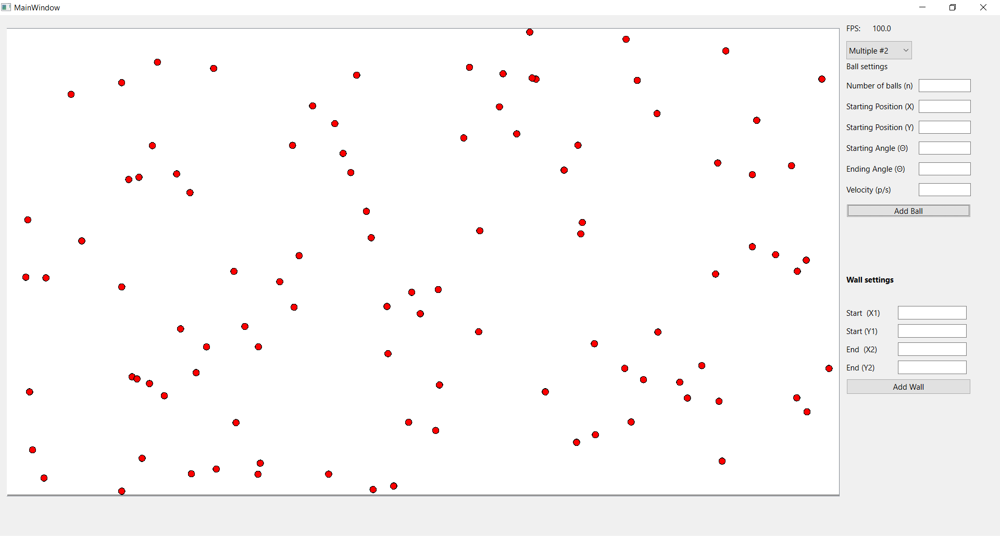
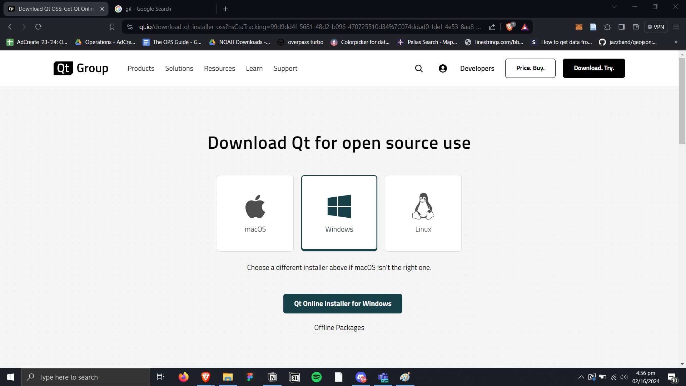
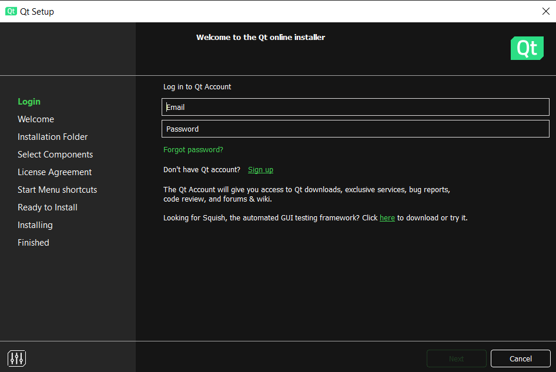
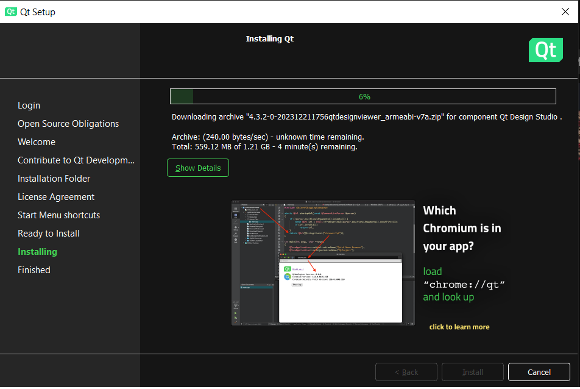
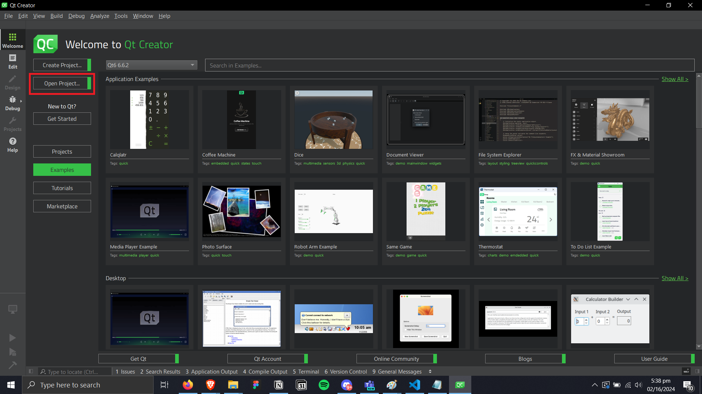
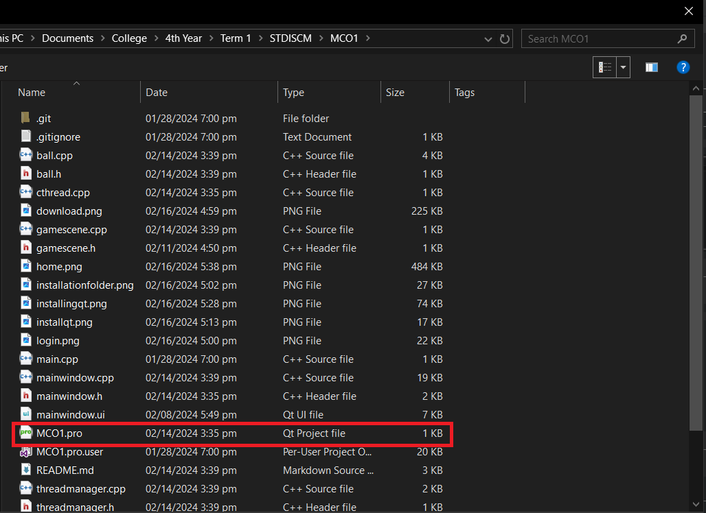
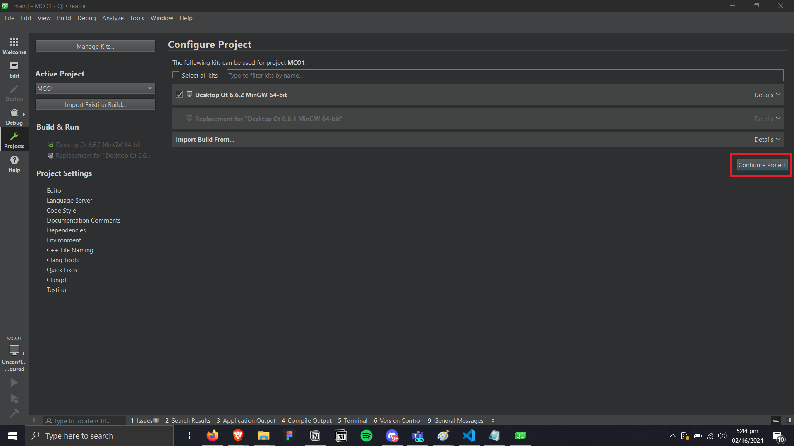
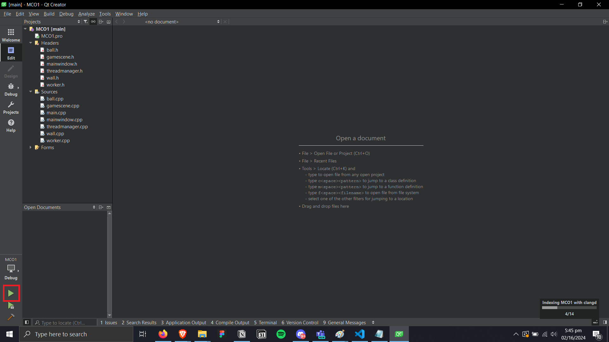

# Particle simulator

This project is a multithreaded particle simulator that uses C++. The user can add particles and walls into a 1280x720 canvas. These particles can bounce off the walls.

Screenshot of the app

## Getting Started
1. Clone the repository
2. Download QT 6.6 online installer [here](https://www.qt.io/download-qt-installer-oss)

3. Open the online installer and you'll be greeted with a login screen

4. If you don't have an account, create one by pressing **Sign Up** and fill up necessaru details. If you have an account, proceed to step 5
5. Under **Installation Folder** there will be many installation options, choose **Qt 6.6 for desktop development**
6. Install Qt, it may take a while to install

7. Once its finished, open Qt Creator
8. Select **Open Project**

9. Find the project folder that you want to open and select the file with the file type `.pro`

10. Press **Configure Project**

11. Run the program

## Features
The user can select between 4 modes when creating the balls. 

| Mode   | Description                                                                                                 |
| ------ | ----------------------------------------------------------------------------------------------------------- |
| Mode 1 | Create one particle at a time.                                                                              |
| Mode 2 | Create many particles at once while distributing them equally according to the start and end positions of the ball.  |
| Mode 3 | Create many particles at once while distributing them equally according to the start and end angle of the ball .     |
| Mode 4 | Create many particles at once while distributing them equally according to the start and end velocities of the ball. |

Below is the table of settings that the user can make per mode when creating the particles:
| Mode 1                | Mode 2                | Mode 3                | Mode 4                  |
| --------------------- | --------------------- | --------------------- | ----------------------- |
| Starting Position (X) | Number of balls (n)   | Number of balls (n)   | Number of balls (n)     |
| Starting Position (Y) | Starting Position (X) | Starting Position (X) | Starting Position (X)   |
| Velocity (p/s)        | Starting Position (Y) | Starting Position (Y) | Starting Position (Y)   |
| Angle (θ)             | Ending Position (X)   | Starting Angle (θ)    | Starting Velocity (p/s) |
|                       | Ending Position (Y)   | Ending Angle (θ)      | Ending Velocity (p/s)   |
|                       | Angle (θ)             | Velocity (p/s)        | Angle (θ)               |
|                       | Velocity (p/s)        |                       |                         |

Before creating the wall, the start and end positions need to be setup to define length of the wall across the canvas. Here are the list of settings the user can modify when creating the walls:

- Start (X1)
- Start (Y1)
- End (X2)
- End (Y2)

## Authors
Lim, Aurelius Justin

Yongco, Denzel Bryan
